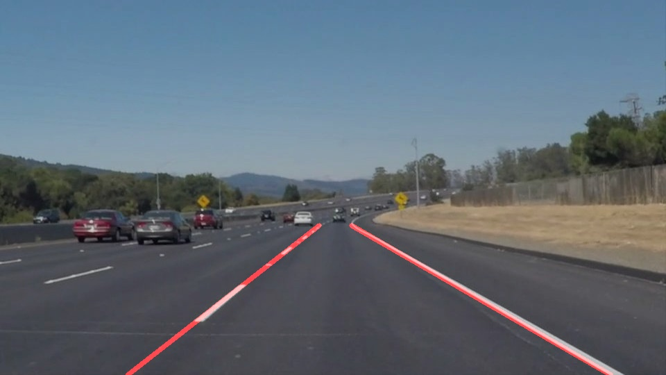

# **Finding Lane Lines on the Road** 

---

The goals / steps of this project are the following:
* Make a pipeline that finds lane lines on the road
* Reflect on your work in a written report

[//]: # (Image References)

[image1]: ./examples/grayscale.jpg "Grayscale"

---

### Reflection

### 1. Describe your pipeline. As part of the description, explain how you modified the draw_lines() function.

My pipeline consisted of 5 steps. First, I converted the images to grayscale, then I define a kernel size for Gaussian smoothing, which makes it better for canny edges. 
Realizing that the camera is often placed at the same position, so I create a masked edges for Hough transform. Of courese the parameter need some adjustments, but still 
not too hard. And finally, I overlay the image with the help of *weighted_image*.

In order to draw a single line on the left and right lanes, I modified the draw_lines() function by dividing the Hough-Transformed-lines into two parts, group left and 
group right. For lines in each group, they all contain a slope *((y2-y1)/(x2-x1))* and a center *(x1+x2)/2, (y1+y2)/2*, then conbine them by weights, which here is the 
length of each line. Thus we gain a single solid line with a sum slope and a center. The only thing left is just to decide the scale of axis-y to draw lines.

### 2. Identify potential shortcomings with your current pipeline

One potential shortcoming would be what would happen when ... 

Another shortcoming could be ...

### 3. Suggest possible improvements to your pipeline

A possible improvement would be to ...

Another potential improvement could be to ...
